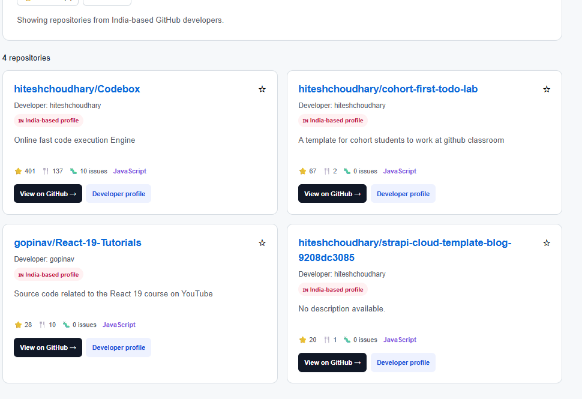

# 🇮🇳 India GitHub Explorer

> A developer-focused GitHub repository discovery tool for exploring public repositories from GitHub users who list India as their location.


---

## 📌 About the Project

**India GitHub Explorer** is a frontend web application built with **HTML5, CSS3 and Vanilla JavaScript**.

The application uses the **GitHub REST API** to discover public repositories from GitHub users who list **India** as their profile location.

Users can search for technologies, filter repositories, sort results, view developer information and save favorite repositories.

I built this project to practice **REST API integration, asynchronous JavaScript, Fetch API, LocalStorage, client-side caching and API error handling**.

---

## ✨ Features

- 🇮🇳 India-focused GitHub developer discovery
- 🔍 Search by technology or keyword
- 💻 Filter repositories by programming language
- ⭐ Filter by minimum stars
- 📊 Sort repositories
- 👤 View GitHub developer profiles
- ⭐ Save favorite repositories
- 💾 LocalStorage support
- ⚡ Client-side API caching
- 🛑 GitHub API rate-limit handling
- 🔗 Direct GitHub repository links
- 📱 Responsive interface
- ⚠️ API error handling

---

## 🖥️ Screenshots

### 🏠 Homepage


The homepage provides the main search interface and navigation for exploring GitHub repositories.

---

### 📚 Repository Directory



The repository directory displays repository information including:

- Repository name
- Owner
- Description
- Stars
- Forks
- Open issues
- Programming language
- GitHub repository link

---

## 🔄 How It Works

```text
User enters a keyword
        ↓
GitHub User Search API
        ↓
Find users who list India
        ↓
Get their public repositories
        ↓
Receive JSON response
        ↓
JavaScript processes the data
        ↓
Search + Filter + Sort
        ↓
Display repository cards
        ↓
Favorites saved in LocalStorage
