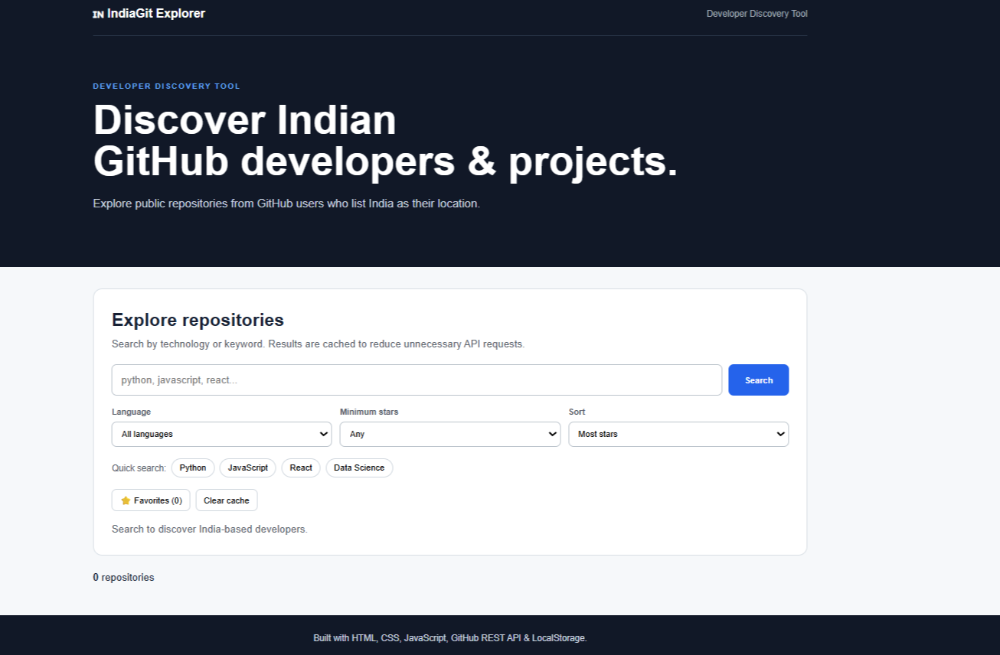

# 🇮🇳 India GitHub Explorer

> A developer-focused GitHub repository discovery tool for exploring public repositories from GitHub users who list India as their location.

## 📌 About the Project

India GitHub Explorer is a frontend web application built with HTML, CSS and JavaScript that uses the GitHub REST API to discover developers and their public repositories.

The project allows users to search repositories by technology, filter results, sort repositories, view developer profiles and save favorite repositories directly in the browser.

I built this project to practice **REST API integration, asynchronous JavaScript, API error handling, client-side caching and developer-focused UI design.**

---

## ✨ Features

- 🇮🇳 Discover repositories from India-based GitHub profiles
- 🔍 Search by technology or keyword
- 💻 Filter repositories by programming language
- ⭐ Filter by minimum number of stars
- 📊 Sort by stars, name or recently updated
- 👤 View GitHub developer profiles
- ⭐ Add repositories to favorites
- 💾 Save favorites using LocalStorage
- ⚡ Client-side API result caching
- 🛑 GitHub API rate-limit handling
- 📱 Responsive design
- 🔗 Direct links to GitHub repositories

---

## 🖥️ Screenshots

### Homepage



### Repository Directory


### Repository / Developer Details


---

## 🔄 How It Works

```text
User searches for a technology
            ↓
     GitHub User Search API
            ↓
 Users who list India as location
            ↓
   GitHub Repositories API
            ↓
      JSON response data
            ↓
 JavaScript processes the data
            ↓
 Filter + Sort + Search
            ↓
      Repository Cards
